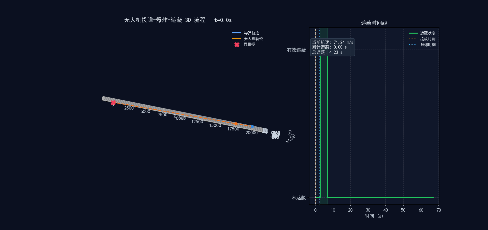
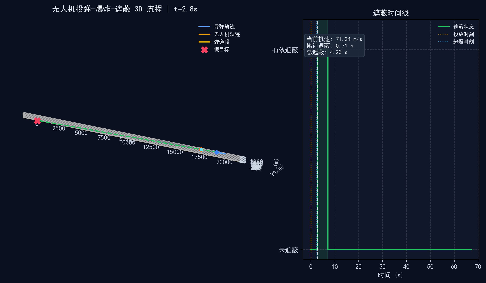
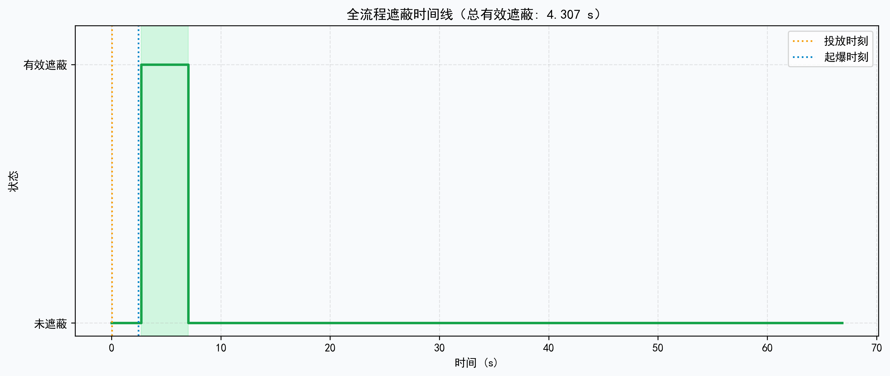
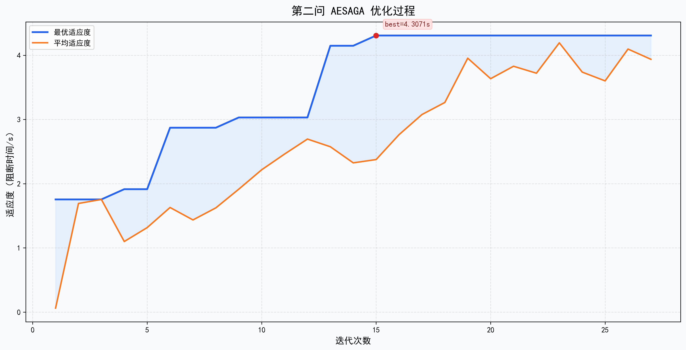
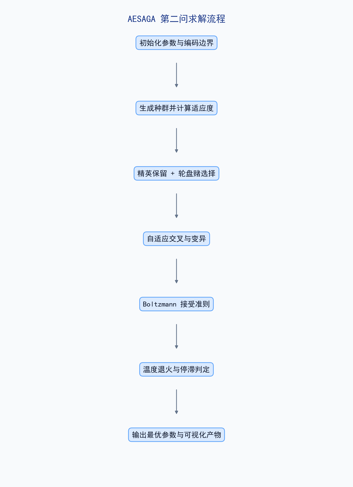

<div align="center">

# 2025 国赛 A 题：无人机投弹策略优化

从建模假设、算法优化到 3D 全流程动态展示的完整工程化仓库。

[](requirements.txt)
[](2-code/第二问/aesaga第二问.py)
[](docs/README.md)

</div>



## 封面展示（核心）

- 3D 动态封面：投弹、下落、起爆、烟幕下沉、导弹视线遮蔽全过程。  
- 无需运行代码即可查看：主页第一屏直接展示关键过程与效果。  
- 论文与结果一键跳转：查看门槛低，适合答辩和对外展示。

## 你最关心的两件事

1. 论文与赛题原文是否能直接看
2. 结果和可视化是否能不跑代码直接看到

本仓库已把这两件事放在最前面，支持主页一键跳转。

## 一键直达

### 论文与题面

- [主论文 PDF](1-paper/25年数模国赛论文.pdf)
- [A 题题面 PDF](1-paper/A题.pdf)
- [结果附件总览](1-paper/附件/README.md)
- [问题三结果表 result1.xlsx](1-paper/附件/result1.xlsx)
- [问题四结果表 result2.xlsx](1-paper/附件/result2.xlsx)
- [问题五结果表 result3.xlsx](1-paper/附件/result3.xlsx)

### 代码模块

- [代码总览](2-code/README.md)
- [第一问：单机单弹](2-code/第一问/README.md)
- [第二问：单机单弹优化](2-code/第二问/README.md)
- [第三问：单机多弹协同](2-code/第三问/README.md)
- [第四问：多机协同](2-code/第四问/README.md)
- [第五问：两阶段匹配+局部优化](2-code/第五问/README.md)
- [第五问不同方法实验](2-code/第五问%20-不同方法实验/README.md)

### 展示与复现

- [3D 全流程展示（封面）](docs/showcase/full_process/README.md)
- [展示产物入口](docs/showcase/README.md)
- [第二问展示面板](docs/showcase/second_question/README.md)
- [复现指南](docs/REPRODUCTION.md)
- [展示说明](docs/PRESENTATION.md)

## 可视化展示

### 3D 全流程快照



### 全流程遮蔽时间线



### 收敛曲线



### 算法流程图



## 结果摘要

| 模块 | 指标 | 结果 |
| --- | --- | --- |
| 问题一 | 基础遮蔽时长 | 约 1.39 s |
| 问题二 | 单机单弹优化（论文最优） | 4.69 s |
| 问题三 | 单机三弹协同 | 5.81 s |
| 问题四 | 三机协同 | 8.04 s |
| 问题五 | 多机多弹综合策略 | 见 result3.xlsx |
| 第二问展示复现实验 | 本仓库自动导出 | 4.3071 s |
| 3D 全流程展示 | 封面动画对应遮蔽时长 | 4.3071 s |

注：最后一行来自 [第二问展示摘要](docs/showcase/second_question/aesaga_summary.json)，用于主页动态图与流程图展示，不替代论文最终实验配置。

## 快速复现

```powershell
conda env create -f environment.yml
conda activate hnu_aesaga
pip install -r requirements.txt
python "2-code/第二问/aesaga第二问.py" --generations 90 --pop-size 28 --pace 420 --output-dir "docs/showcase/second_question" --hero-output-dir "docs/showcase/full_process"
```

## 仓库观感优化说明

- 首页第一屏直接给出 3D 动态封面，强化“结果先行”的展示体验。
- 各题目录均含独立 README，统一为“问题定位-核心脚本-输入输出-运行建议”结构。
- 论文与结果表格入口前置，确保访问者快速找到最关心内容。

## 仓库结构

```text
2025国赛A_参赛/
├─ README.md
├─ 1-paper/
│  ├─ 25年数模国赛论文.pdf
│  ├─ A题.pdf
│  └─ 附件/
├─ 2-code/
│  ├─ 第一问/
│  ├─ 第二问/
│  ├─ 第三问/
│  ├─ 第四问/
│  ├─ 第五问/
│  └─ 第五问 -不同方法实验/
├─ 3-参考文献/
└─ docs/
	├─ REPRODUCTION.md
	├─ PRESENTATION.md
	└─ showcase/
	   ├─ full_process/
	   └─ second_question/
```

## 说明

- 我承担独立建模与编程实现，仓库保留了多版本实验代码与最终展示资产。
- 每个业务子目录均包含独立说明文档，便于快速交接和答辩讲解。
